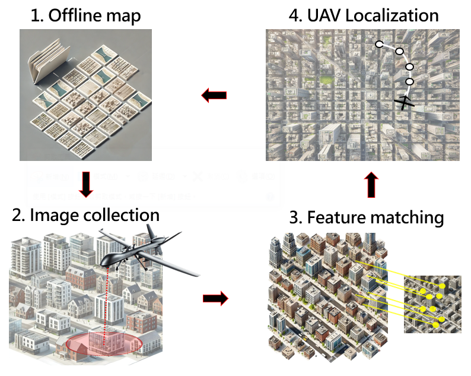

# GPS-Denied-Localization-for-UAVs-with-Feature-Mathcing
This repository implements a GPS-denied UAV localization algorithm based on KAZE feature matching and image correction, designed as a **Software-In-the-Loop (SIL)** simulation platform. The system enables UAVs to localize themselves using aerial imagery and onboard sensors (IMU/INS) without relying on GPS signals.

## Overview
This project was developed to bridge the gap between algorithm theory and practical deployment by simulating the system in a UAV onboard environment via SIL. The implementation includes multithreaded real-time processing and socket-based communication, emulating real-world UAV data flow between sensors and compute nodes.

## Project Structure

